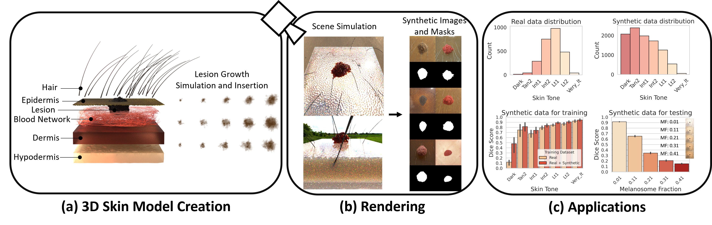
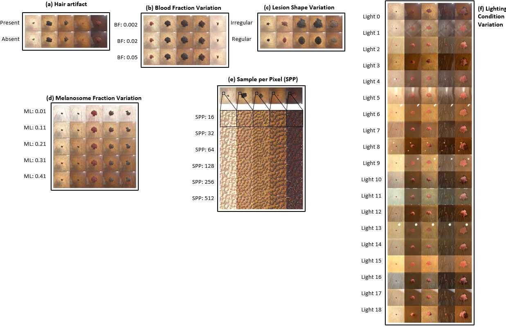

# S-SYNTH: Knowledge-Based, Synthetic Generation of Skin Images

**This repository contains code used in the paper:**

"_S-SYNTH: Knowledge-Based, Synthetic Generation of Skin Images_"

[Andrea Kim](https://www.linkedin.com/in/andreakim91), [Niloufar Saharkhiz](https://www.linkedin.com/in/niloufar-saharkhiz/), [Elena Sizikova](https://esizikova.github.io/), [Miguel Lago](https://www.linkedin.com/in/milaan/), [Berkman Sahiner](https://www.linkedin.com/in/berkman-sahiner-6aa9a919/), [Jana Delfino](https://www.linkedin.com/in/janadelfino/), [Aldo Badano](https://www.linkedin.com/in/aldobadano/)

International Conference on Medical Image Computing and Computer Assisted Intervention (MICCAI) 2024

**Paper Link**: [TODO]()
 



The contributions of our work are:

* We describe S-SYNTH, an open-source, flexible framework for creation of highly-detailed 3D skin models and digitally rendered synthetic images of iverse human skin tones, with full control of underlying parameters and the image formation process.
  
* We systematically evaluate S-SYNTH synthetic images for training and testing applications. Specifically, we show S-SYNTH synthetic images improve segmentation performance when only a limited set of real images is available for training. We also show comparative trends between S-SYNTH synthetic images and real-patient examples (according to skin color and lesion size) are similar.

## Table of Contents

1. Framework
2. Code
3. Citation
4. Related Links
5. Disclaimer

## Framework

We present S-SYNTH, the first knowledge-based, adaptable open-source skin simulation framework to rapidly generate synthetic skin models and images using digital rendering of an anatomically inspired multi-layer, multi-component skin and growing lesion model. The skin model allows for controlled variation in skin appearance, such as skin color, presence of hair, lesion size, skin and lesion colors, and blood fraction among other parameters. We use this framework to study the effect of possible variations on the development and evaluation of AI models for skin lesion segmentation, and show that results obtained using synthetic data follow similar comparative trends as real dermatologic images, while mitigating biases and limitations from existing datasets including small dataset size, mislabeled examples, and lack of diversity.

S-SYNTH can be used to generate synthetic skin images with annotations (including segmentation masks) with variations:



**Usage:** S-SYNTH relies on [Houdini](https://www.sidefx.com/) for creating of skin layers and [Mitsuba](https://mitsuba-renderer.org/) for rendering.

## Code
The code will be available soon.
  

## Data
Associated data for this repository, including pre-generated synthetic skin examples and their masks, can be found in a Huggingface dataset repo ([S-SYNTH data](https://huggingface.co/datasets/didsr/ssynth_data)). 

## Citation
```
@article{kim2024ssynth,
  title={Knowledge-based in silico models and dataset for the comparative evaluation of mammography AI for a range of breast characteristics, lesion conspicuities and doses},
  author={Kim, Andrea and Saharkhiz, Niloufar and Sizikova, Elena and Lago, Miguel, and Sahiner, Berkman and Delfino, Jana G., and Badano, Aldo},
  journal={International Conference on Medical Image Computing and Computer Assisted Intervention (MICCAI)},
  volume={},
  pages={},
  year={2024}
}
```
## Related Links
1. E. Sizikova, N. Saharkhiz, D. Sharma, M. Lago, B. Sahiner, J. G. Delfino, A. Badano. [Knowledge-based in silico models and dataset for the comparative evaluation of mammography AI for a range of breast characteristics, lesion conspicuities and doses](https://github.com/DIDSR/msynth-release). NeurIPS Datasets and Benchmarks Track 2023.
2. [M-SYNTH: A Dataset for the Comparative Evaluation of Mammography AI](https://cdrh-rst.fda.gov/m-synth-dataset-comparative-evaluation-mammography-ai).
1. [Virtual Imaging Clinical Trial for Regulatory Evaluation (VICTRE)](https://www.fda.gov/medical-devices/science-and-research-medical-devices/victre-silico-breast-imaging-pipeline).
2. [FDA Catalog of Regulatory Science Tools to Help Assess New Medical Devices](https://www.fda.gov/medical-devices/science-and-research-medical-devices/catalog-regulatory-science-tools-help-assess-new-medical-devices).
4. A. Badano, M. Lago, E. Sizikova, J. G. Delfino, S. Guan, M. A. Anastasio, B. Sahiner. [The stochastic digital human is now enrolling for in silico imaging trials—methods and tools for generating digital cohorts.](http://dx.doi.org/10.1088/2516-1091/ad04c0) Progress in Biomedical Engineering 2023.   


## Disclaimer
<sub>
This software and documentation (the "Software") were developed at the Food and Drug Administration (FDA) by employees of the Federal Government in the course of their official duties. Pursuant to Title 17, Section 105 of the United States Code, this work is not subject to copyright protection and is in the public domain. Permission is hereby granted, free of charge, to any person obtaining a copy of the Software, to deal in the Software without restriction, including without limitation the rights to use, copy, modify, merge, publish, distribute, sublicense, or sell copies of the Software or derivatives, and to permit persons to whom the Software is furnished to do so. FDA assumes no responsibility whatsoever for use by other parties of the Software, its source code, documentation or compiled executables, and makes no guarantees, expressed or implied, about its quality, reliability, or any other characteristic. Further, use of this code in no way implies endorsement by the FDA or confers any advantage in regulatory decisions. Although this software can be redistributed and/or modified freely, we ask that any derivative works bear some notice that they are derived from it, and any modified versions bear some notice that they have been modified.
</sub>
