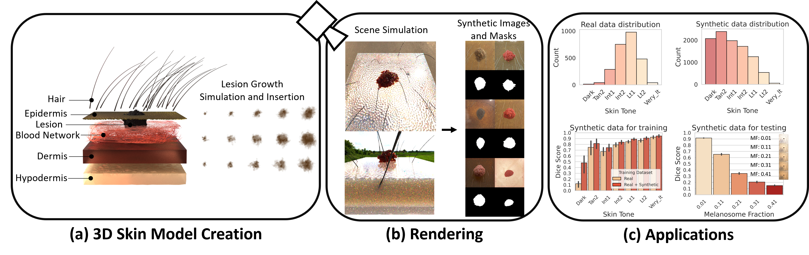
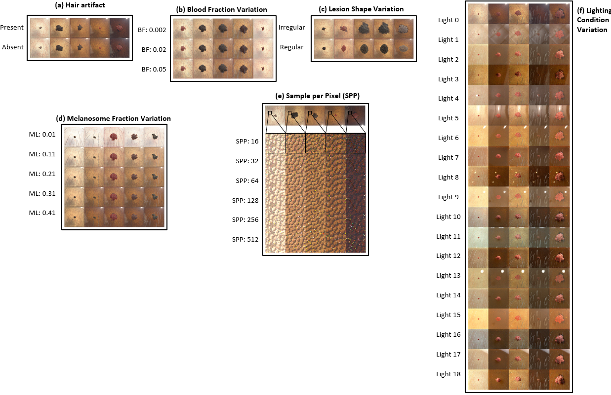
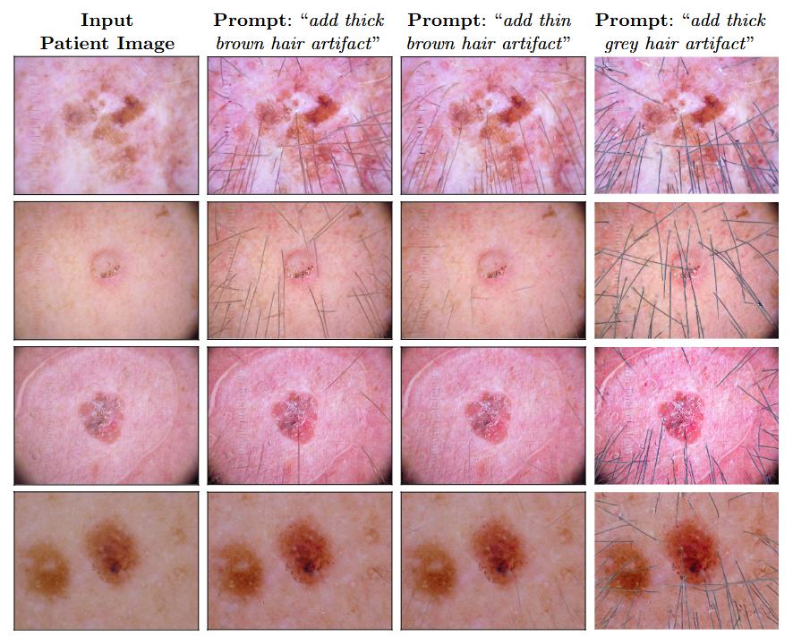

# OASIS: Generating Synthetic Skin Artifacts

## News
- June 2, 2026: OASIS code added (initial release)
- May 6, 2026: extended IJCARS version available, demonstrating downstream training of diffusion models
- August 1, 2024: initial release of S-SYNTH

## Description

This repository contains code described in:

1. Elena Sizikova, Niloufar Saharkhiz, Jana Delfino, Aldo Badano

   ["OASIS: Generating Synthetic Skin Artifacts"](https://openaccess.thecvf.com/content/CVPR2026W/DataCV/html/Sizikova_OASIS_Generating_Synthetic_Skin_Artifacts_CVPRW_2026_paper.html)
 
   IEEE/CVF Conference on Computer Vision and Pattern Recognition (CVPR) DataCV Workshop 2026

2. Andrea Kim, Niloufar Saharkhiz, Elena Sizikova, Miguel Lago, Berkman Sahiner, Jana Delfino, Aldo Badano.
   
   ["S-SYNTH: Knowledge-Based, Synthetic Generation of Skin Images"](https://arxiv.org/abs/2408.00191)
   
   International Conference on Medical Image Computing and Computer Assisted Intervention (MICCAI) 2024
3. Elena Sizikova, Niloufar Saharkhiz, Andrea Kim, Miguel Lago, Jana Delfino, Aldo Badano

   ["Synthetic skin image generation using a physics-based, object-to-image computational pipeline"](https://doi.org/10.1007/s11548-026-03587-2)
 
   International Journal of Computer Assisted Radiology and Surgery (IJCARS) 2026

S-SYNTH is an open-source, flexible framework for creation of highly-detailed 3D skin models and digitally rendered synthetic images of diverse human skin tones, with full control of underlying parameters and the image formation process. OASIS extends S-SYNTH to the generation of five commonly occuring skin artifacts.



S-SYNTH/OASIS can be used to generate synthetic skin images with annotations (including segmentation masks) with variations in skin appearance, such as skin color, presence of hair, lesion size, skin and lesion colors, and blood fraction among other parameters. We use this framework to study the effect of possible variations on the development and evaluation of AI models for skin lesion segmentation, and show that results obtained using synthetic data follow similar comparative trends as real dermatologic images, while mitigating biases and limitations from existing datasets including small dataset size, mislabeled examples, and lack of diversity.



S-SYNTH/OASIS images can be used to create paired datasets to finetune diffusion models, teaching them concepts about skin imaging:

   
## Code

**Usage:** S-SYNTH/OASIS relies on [Houdini](https://www.sidefx.com/) for creating of skin layers and [Mitsuba](https://mitsuba-renderer.org/) for rendering.

Please see `code` directory for

- Code for generating materials, skin models, and synthetic skin lesions
- Creating paired datasets for training diffusion models to add and remove artifacts.
## Data

Associated data for this repository, including pre-generated synthetic skin examples and their masks, can be found in the Hugging face dataset repo ([S-SYNTH data](https://huggingface.co/datasets/didsr/ssynth_data)).

<!--## Repository Structure

```
├── code
|   ├── test.py
├── examples
├── images
├── LICENSE
└── README.md
```-->

A visualization of sample resulting images is available in the demo: [https://didsr.github.io/ssynth-release/](https://didsr.github.io/ssynth-release/)


## Citation

```
@article{sizikova2026oasis,
  title={OASIS: Generating Synthetic Skin Artifacts},
  author={Sizikova, Elena and Saharkhiz, Niloufar and Delfino, Jana G., and Badano, Aldo},
  journal={IEEE/CVF Conference on Computer Vision and Pattern Recognition (CVPR) DataCV Workshop},
  volume={},
  pages={},
  year={2026}
}


@article{sizikova2026synthetic,
  title={Knowledge-based in silico models and dataset for the comparative evaluation of mammography AI for a range of breast characteristics, lesion conspicuities and doses},
  author={Sizikova, Elena and Saharkhiz, Niloufar and Kim, Andrea and Lago, Miguel and Delfino, Jana G., and Badano, Aldo},
  journal={International Journal of Computer Assisted Radiology and Surgery (IJCARS)},
  volume={},
  pages={},
  year={2026}
}

@article{kim2024ssynth,
  title={Knowledge-based in silico models and dataset for the comparative evaluation of mammography AI for a range of breast characteristics, lesion conspicuities and doses},
  author={Kim, Andrea and Saharkhiz, Niloufar and Sizikova, Elena and Lago, Miguel, and Sahiner, Berkman and Delfino, Jana G., and Badano, Aldo},
  journal={International Conference on Medical Image Computing and Computer Assisted Intervention (MICCAI)},
  volume={},
  pages={},
  year={2024}
}
```

## Related Links

1. [FDA Catalog of Regulatory Science Tools to Help Assess New Medical Devices](https://www.fda.gov/medical-devices/science-and-research-medical-devices/catalog-regulatory-science-tools-help-assess-new-medical-devices).
2. A. Badano, M. Lago, E. Sizikova, J. G. Delfino, S. Guan, M. A. Anastasio, B. Sahiner. [The stochastic digital human is now enrolling for in silico imaging trials—methods and tools for generating digital cohorts.](http://dx.doi.org/10.1088/2516-1091/ad04c0) Progress in Biomedical Engineering 2023.

## Disclaimer

<sub>
This software and documentation (the "Software") were developed at the Food and Drug Administration (FDA) by employees of the Federal Government in the course of their official duties. Pursuant to Title 17, Section 105 of the United States Code, this work is not subject to copyright protection and is in the public domain. Permission is hereby granted, free of charge, to any person obtaining a copy of the Software, to deal in the Software without restriction, including without limitation the rights to use, copy, modify, merge, publish, distribute, sublicense, or sell copies of the Software or derivatives, and to permit persons to whom the Software is furnished to do so. FDA assumes no responsibility whatsoever for use by other parties of the Software, its source code, documentation or compiled executables, and makes no guarantees, expressed or implied, about its quality, reliability, or any other characteristic. Further, use of this code in no way implies endorsement by the FDA or confers any advantage in regulatory decisions. Although this software can be redistributed and/or modified freely, we ask that any derivative works bear some notice that they are derived from it, and any modified versions bear some notice that they have been modified.
</sub>

"_OASIS: Generating Synthetic Skin Artifacts_"

[Elena Sizikova*](https://esizikova.github.io/), [Niloufar Saharkhiz*](https://www.linkedin.com/in/niloufar-saharkhiz/), [Jana G. Delfino](https://www.linkedin.com/in/janadelfino/), [Aldo Badano](https://www.linkedin.com/in/aldobadano/)

*-equal contribution
    
The IEEE/CVF Conference on Computer Vision and Pattern Recognition (CVPRW) DataCV Workshop and Challenge 2026
